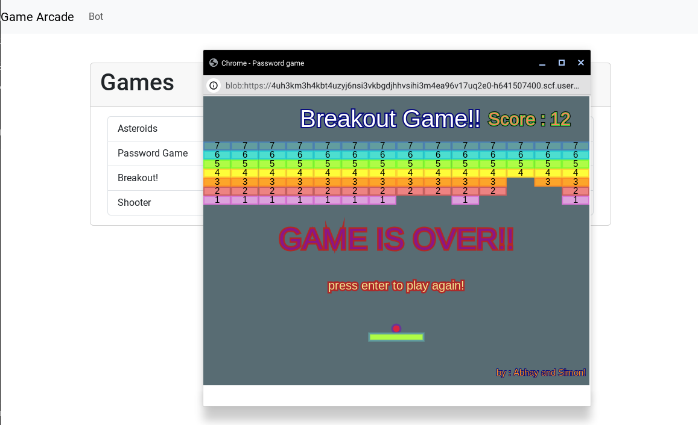

# Game Arcade writeup by [@terjanq](https://twitter.com/terjanq)

As it always have been with my challenges for Google CTF, they are based
on real bugs I found internally. This year is a bit different though. This time the
bugs were crafted by no other than me myself. One bug didn't manage to reach the
production and the other is still present in prod making it effectively a 0day!

Both of my challenges (Postviewer v3 & Game Arcade) for this year are are related
to a sandboxing I've been working since the first Postviewer challenge. You can
read a little bit about it in
[here](https://web.dev/articles/securely-hosting-user-data#approach_2_serving_active_user_content).

**If you managed to solve `Game Arcade` in an unintended way or found other bugs in
`*.scf.usercontent.goog` please message us on discord. It's probably a 0day and
it might qualify for our VRP program.**

## Intro

> GAME ARCADE &nbsp;&nbsp;&nbsp;&nbsp; [333pt]
>
> Hello Arcane Worrier! Are you ready, to break. the ARCADE. GAME.
>
> Note: The challenge does not require any brute-forcing or content-discovery.
>
> https://postviewer3-web.2024.ctfcompetition.com\
> Solved by (14):\
> Friendly Maltese Citizens, justCatTheFish, FluxFingers and more.


Similarly to my other challenge, a player is welcomed with a Postviewer alike page
that let them choose and play a game.



Each game is rendered in a popup via shim located at `https://<game_hash>-h641507400.scf.usercontent.goog/google-ctf/shim.html`.
This is a production shim that we use in our Google products.

The goal of the challenge is to leak admin's password that's stored in `localStorage`
and/or `document.cookie`.

_This write-up assumes that the reader is familiar with the Postviewer v3 challenge.
If not, please read the [Postviewer v3 writeup] first._

## Hashing

File hash that's stored in the game's origin is calculated by the following
formula:

```js
sha256(product + "$@#|" + salt + "$@#|" + origin);
```

Unlike in the Postviewer v3 challenge, the hashing method should have been secure
against any practical attacks. The `origin` at the end ensures that only an embedding
page can talk with the shim.

In the challenge, `product` is simply equal to `google-ctf` and `salt` is contents of
a game to make them isolated from each other. The `origin` is challenge's page
`https://game-arcade-web.2024.ctfcompetition.com`.


## Guess the Password

Admin plays Guess the Password game where they simply input a flag. The flag
is then inserted into `document.cookie` and `localStorage`.

It's important to note that admin uses a Firefox browser and the intended solution
only works there. That's because it's not possible to set or read cookies in
`blob:` documents in Chrome (why? no idea), which is a vital part of the challenge.

The game also has a simple XSS sink coming from `document.cookie`.

```js
let password = getCookie('password') || localStorage.getItem('password') || "okoń";
let correctPasswordSpan = document.createElement('span');
correctPasswordSpan.classList.add('correct');
correctPasswordSpan.innerHTML = password;
```

An XSS payload `` stored in the password would result
in a popup. This is an interesting case where the element doesn't have to be
attached to the DOM, I learned the trick when solving a challenge from
[Michał Bentkowski](https://twitter.com/SecurityMB) a couple years back.

## Subdomain

The goal is to add cookies to the `0ta1gxvglkyjct11uf3lvr9g3b45whebmhcjklt106au2kgy3e-h641507400.scf.usercontent.goog`
origin. Adding a cookie to `.scf.usercontent.goog` would not
work since it acts like a top-level domain thanks to the `*.usercontent.goog`
entry in the [Public Suffix List](https://publicsuffix.org/list/).

Players had to notice a vulnerability in how we handle hashing when the user
supplies double hash in the URL. For a URL in the form of
`http://<hash1>-h641507400.<hash2>-h641507400.scf.usercontent.goog` the SHIM
would incorrectly try to only confirm that the first hash matches the received
data over postMessage, mking it trivial to execute arbitrary code under
any site. Because of SSL cert errors, the cookie needs to be set from a http://
URL.


## Exploit

The final solution is very simple. From malicious.site do the following:
1. Calculate hash of the exploit adding an XSS to the cookie.
2. Execute it under `http://<poc-hash>-h641507400.0ta1gxvglkyjct11uf3lvr9g3b45whebmhcjklt106au2kgy3e-h641507400.scf.usercontent.goog/google-ctf/shim.html?origin=https://malicious.site`.
3. From the XSS, exfiltrate `document.cookie` or `localStorage` where the flag is stored.

See the full [exploit](./solution/solve.html).

## Closing thoughts

This challenge unexpectedly got less solves than Postviewer v3. It was supposed
to be a significantly easier challenge. I'm curious to hear what were the blockers
for the teams attempting to solve it!

If you enjoyed the writeup, check out my writeups for previous editions!

- [Security Driven](https://gist.github.com/terjanq/458d8ec1148e96f7ccbdccfd908c56f6)
- [Postviewer](https://gist.github.com/terjanq/7c1a71b83db5e02253c218765f96a710)
- [Postviewer v2](https://github.com/google/google-ctf/blob/main/2023/quals/web-postviewer2/solution/README.md)


[Postviewer v3 writeup]: <../web-postviewer3/README.md>
